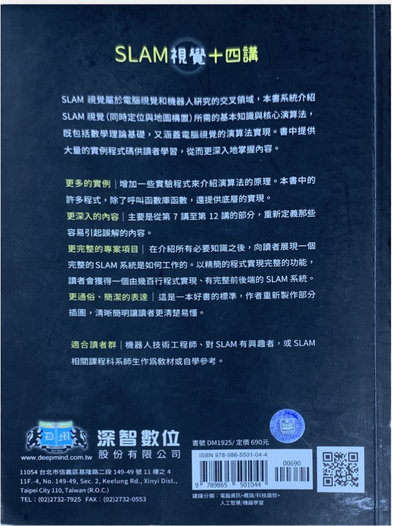

# WarpImageUsingHomography
This project practice of how to calculate homography between two images and Warp a tilted image

WarpImageUsingHomography include two features:

* Calculate Homography between two images and calculate the error if groundtruth is givin
* Warp a tilted image into rectified image

## Installation

### Requirements

* Python >= 3.7
* Numpy
* opencv-python and opencv-contrib-python version == 3.4.2.16 or enable nonfree opencv-python==4.5.1.48

## Usage

### Homography Estimation

#### Estimate Image_1 to Image_2 homography without ground truth

```
python3 homography.py Image1=<Path to image 1> Image2=<Path to image 2> PointNumber=<Number of Points to calculate homography> DistanceRatio=<Ratio to perform distance test> Demo=False
```

#### Estimate Image_1 to Image_2 homography with ground truth

```
python3 homography.py Image1=<Path to image 1> Image2=<Path to image 2> GroundTruth=<Path to the ground truth np file> PointNumber=<Number of Points to calculate homography> DistanceRatio=<Ratio to perform distance test> Demo=False
```

#### Estimate Image_1 to Image_2 homography with demo file

```
python3 homography.py GroundTruth=groundtruth_correspondences/correspondence_01.npy
```

### Image Warping

```
python3 warpImage.py Image=<Path to image to be rectified>
```

After running the warpImage.py please click the four corners of document start from left-top and **clockwisely** other four points

The following is demo of warping File_000.png





## License
The MIT License (MIT)
